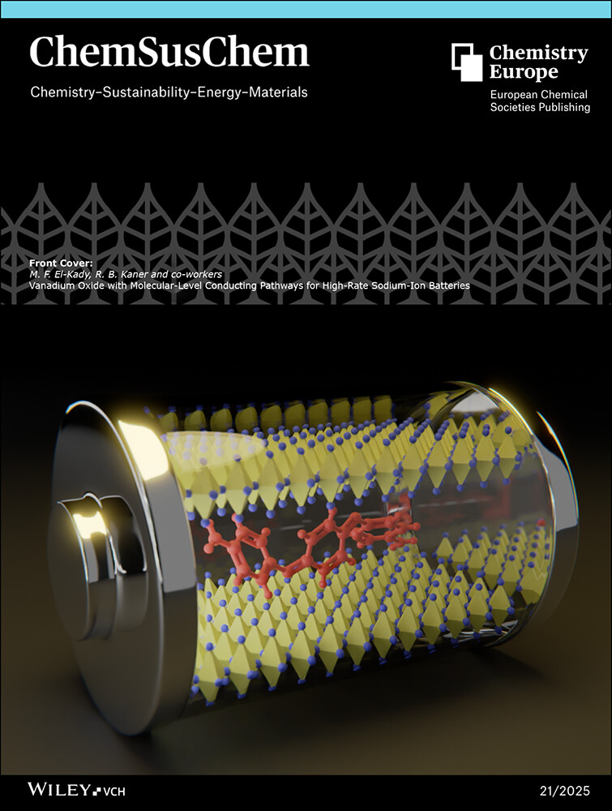
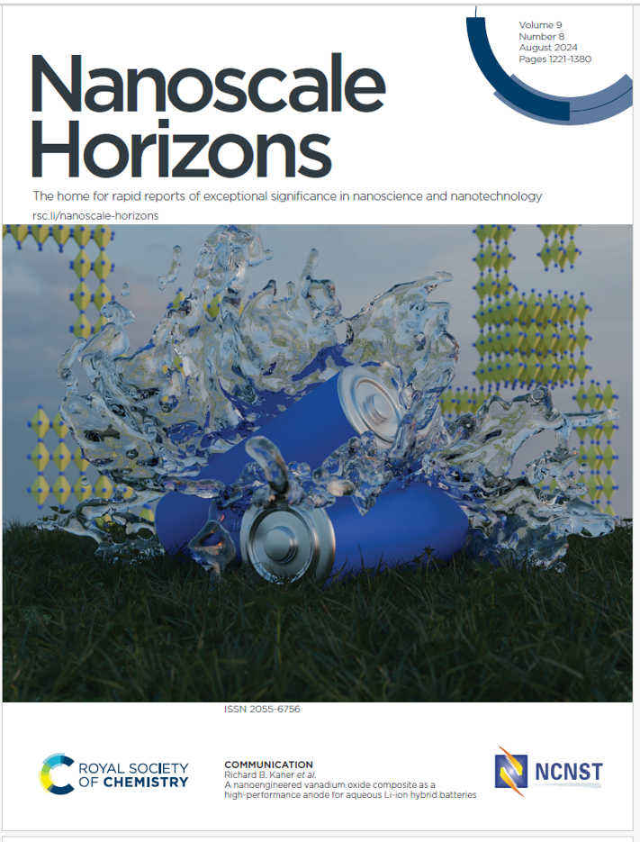
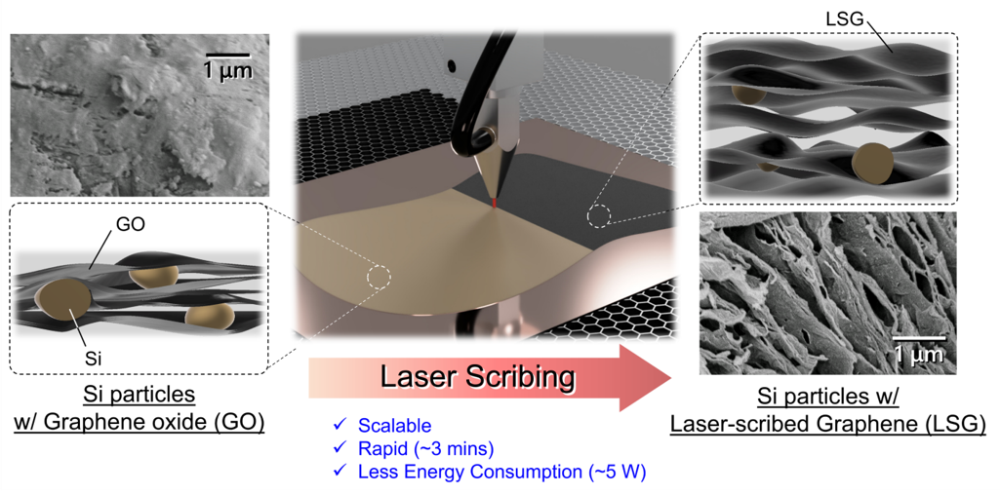

### Zhiyin Yang | Battery Materials Scientist

## About Me

I am a PhD in Chemistry at UCLA specializing in energy storage materials and electrochemistry. My research focuses on developing and understanding aqueous battery systems for scalable and safe energy storage. My work integrates materials design, electrochemical characterization, and interfacial analysis to improve performance and stability in lithium-, sodium-, and zinc-based aqueous batteries.

I am actively seeking industry roles in:
- Battery R&D (materials / electrochemistry)
- Semiconductor process engineering
- Energy storage and advanced materials development

📄 [Download CV](Resume.pdf)
🔬[Google Scholar](https://scholar.google.com/citations?view_op=list_works&hl=en&hl=en&user=kdc_Ez8AAAAJ&sortby=pubdate)

## Selected Work

### Novel Sodium-Ion Battery Anode Materials 
Developed intercalation-modified vanadium oxide (ATVO) anode materials with improved cycling stability and capacity in aqueous sodium-ion systems.

### Electrolyte Engineering for Aqueous Lithium-ion Batteries
Designed and optimized electrolyte systems to expand electrochemical stability windows and suppress parasitic reactions in Li aqueous batteries.

### Silicon-Based Energy Storage Materials
Studied structure–property relationships in silicon anode to improve charge storage mechanisms and cycling stability for lithium-ion batteries.

## Technical Skills

**Electrochemistry**
- Cyclic voltammetry (CV), galvanostatic cycling, EIS
- Battery assembly and testing (coin cells / pouch cells)

**Materials Characterization**
- XRD, SEM, TEM, Raman, XPS

## Contact
Email: zyang0203@g.ucla.edu
[LinkedIn](https://www.linkedin.com/in/zhiyin-tara-yang-9a17aa169/)

